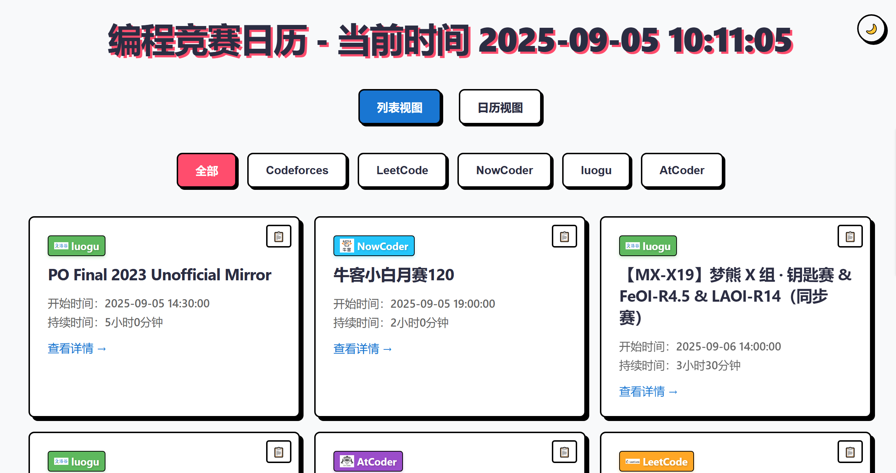
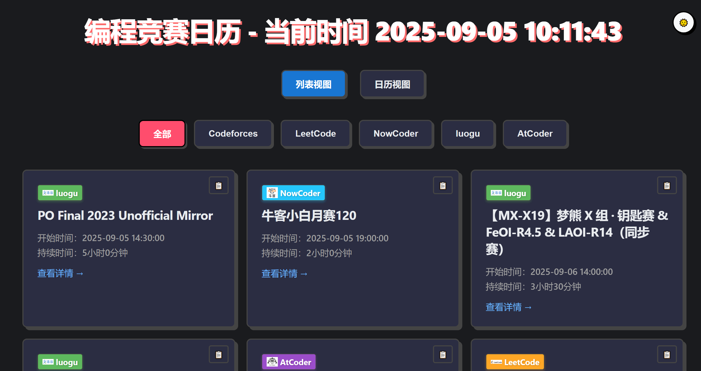
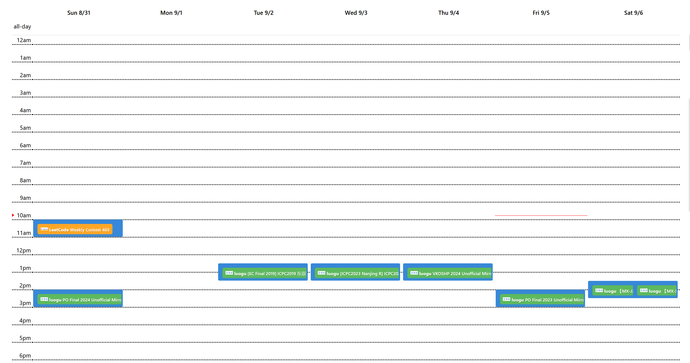
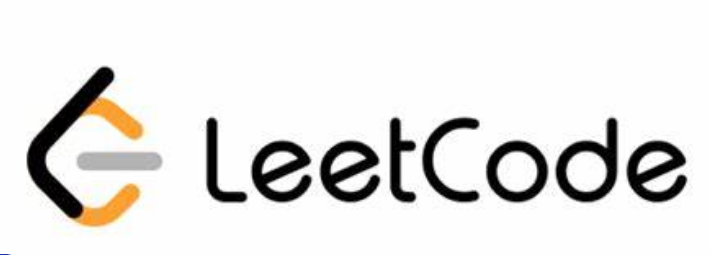
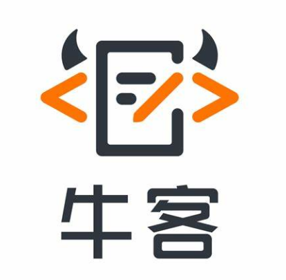
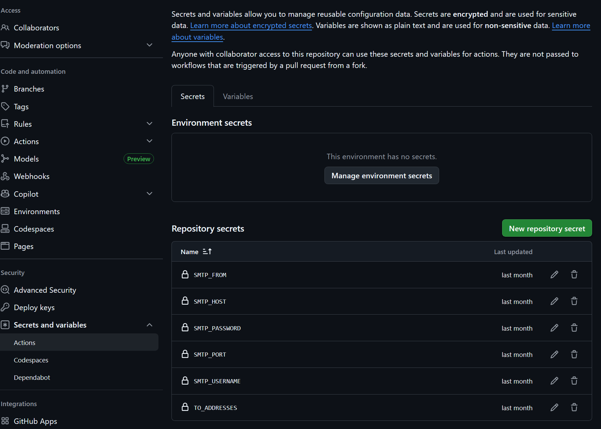
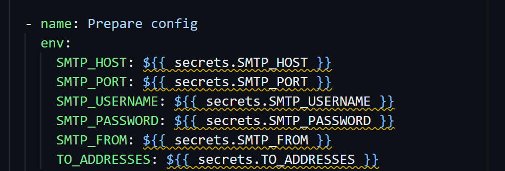

# 编程竞赛日历 🏆

一个现代化的编程竞赛日历网页应用，帮助竞赛爱好者追踪各大平台的比赛信息。

> 🎉 2025-08-24 更新：新增邮件提醒系统！现在可以通过 GitHub Actions 实现每日比赛信息推送。

## 预览 👀

### 列表视图展示
| 亮色模式 | 暗色模式 |
|----------|----------|
|  |  |

### 日历视图展示


## ✨ 特色功能

### 1. 现代化界面
- 新粗野主义设计风格
- 支持明暗主题切换
- 响应式布局适配各种设备
- 流畅的动画和交互效果

### 2. 多视图展示
- 列表视图：简洁清晰的比赛概览
- 日历视图：直观的时间安排
- 实时时间线指示器
- 平台快速筛选功能

### 3. 便捷操作
- 一键复制比赛信息
- 快速访问比赛详情
- 智能时区适配
- 多平台信息聚合

### 4. 邮件提醒（新）
- 24小时比赛预告
- 精美的 HTML 邮件模板
- 支持多收件人配置
- GitHub Actions 自动化发送

## 📊 支持平台

| 平台 Logo | 平台 | 说明 | 官网 |
|-----------|------|------|------|
|  | Codeforces | 全球最大的竞赛平台 | [访问](https://codeforces.com) |
|  | AtCoder | 日本顶级竞赛平台 | [访问](https://atcoder.jp) |
|  | LeetCode | 算法题库和竞赛平台 | [访问](https://leetcode.com) |
|  | 牛客网 | 综合竞赛和面试平台 | [访问](https://www.nowcoder.com) |
|  | 洛谷 | 知名算法竞赛平台 | [访问](https://www.luogu.com.cn) |


## 🚀 快速开始

### 在线访问
访问官网：[https://canjisam.github.io/acmApi/](https://canjisam.github.io/acmApi/)

### 本地部署

1. 克隆仓库：
   ```bash
   git clone https://github.com/canjisam/acmApi.git
   cd acmApi
   ```

2. 启动本地服务器：
   ```bash
   # 使用 Python 的 HTTP 服务器
   python -m http.server 8080
   ```

3. 访问网页：
   打开浏览器访问 `http://localhost:8080`

### 配置邮件提醒

1. 准备配置文件：
   ```bash
   cp mailer/config.example.json mailer/config.json
   ```

2. 编辑配置：
   在 `config.json` 中填入你的 SMTP 服务器信息

3. 配置 GitHub Actions：





- 我们在 `.github/workflows/send_contest_email.yml` 中添加了一个每日定时任务。
- 在仓库 Settings -> Secrets 中添加以下 Secrets：
  - SMTP_HOST（例如："smtp.gmail.com"）
  - SMTP_PORT（例如："587"，纯数字）
  - SMTP_USERNAME（SMTP 用户名）
  - SMTP_PASSWORD（SMTP 密码或应用密码）
  - SMTP_FROM（发件人邮箱地址）
  - TO_ADDRESSES（收件人邮箱列表，用逗号分隔，如："user1@example.com,user2@example.com"）
## � 技术实现

### 前端技术
- **Vue 3**：响应式数据处理
- **FullCalendar**：日历视图实现
- **CSS Variables**：主题切换
- **Local Storage**：用户偏好存储

### 后端技术
- **Python**：数据爬取
- **SMTP**：邮件发送
- **GitHub Actions**：自动化部署

### 自动化流程
- 每 15 分钟自动更新比赛数据
- 智能缓存机制确保离线可用
- 失败自动重试（最多 3 次）
- 每日定时发送邮件提醒

## 🤝 参与贡献

欢迎提交 Issue 和 Pull Request！

1. Fork 本仓库
2. 创建特性分支：`git checkout -b feature/AmazingFeature`
3. 提交改动：`git commit -m 'Add some AmazingFeature'`
4. 推送分支：`git push origin feature/AmazingFeature`
5. 提交 Pull Request

## 📜 开源协议

本项目基于 MIT 协议开源，详见 [LICENSE](LICENSE) 文件。

## 📝 版权信息

© 2025 [canjisam](https://github.com/canjisam). All rights reserved.
- 自动化：GitHub Actions
- 数据源：各平台 API + 定时更新

### 自定义开发
1. 修改前端界面
   - 编辑 `index.html` 和相关 CSS 文件
   - 所有样式文件都有详细注释

2. 调整邮件模板
   - 在 `mailer/templates.py` 中修改 HTML 模板
   - 支持自定义 CSS 样式

3. 添加新平台
   - 在 `contests.json` 中添加新平台数据
   - 更新平台标签样式（在 `mailer/templates.py` 中）

## 📝 维护说明

- 项目持续维护，欢迎提交 Issue 和 PR
- 邮件服务采用 GitHub Actions，无需额外服务器
- 建议使用 Gmail 等可靠的 SMTP 服务

## 🔒 安全说明

- 所有密钥通过 GitHub Secrets 管理
- 邮件使用 SSL/TLS 加密传输
- 配置文件已加入 .gitignore

## 📄 许可证

MIT License - 详见 LICENSE 文件

